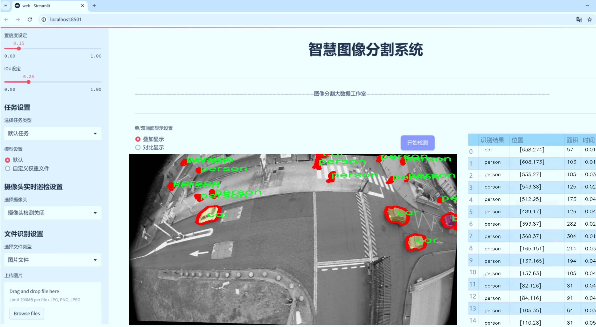
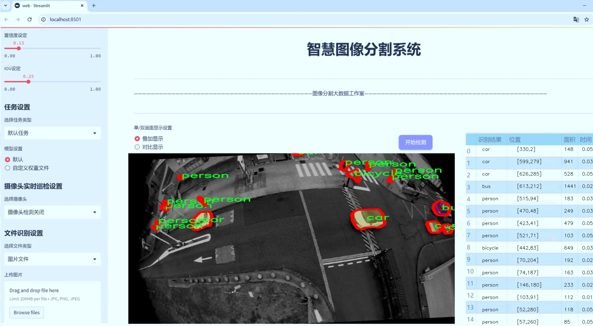
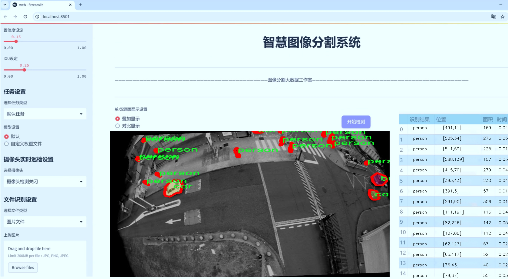
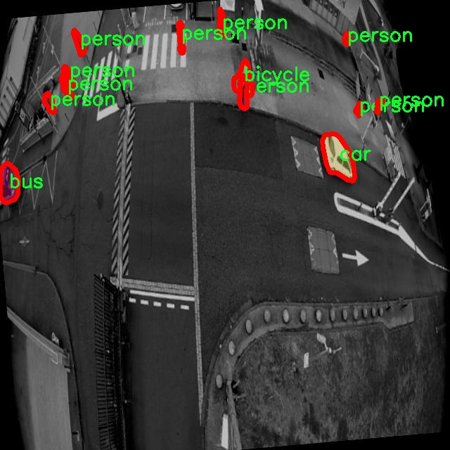
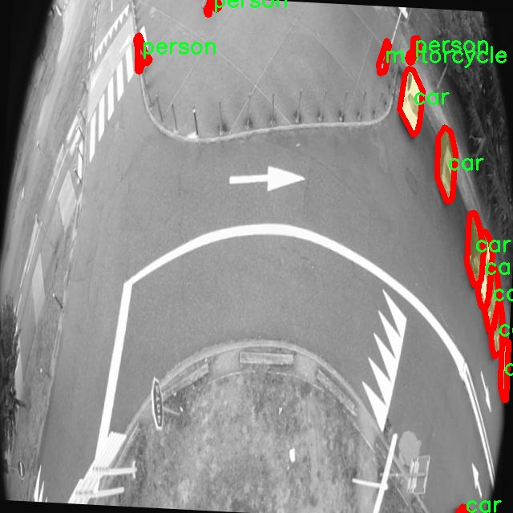
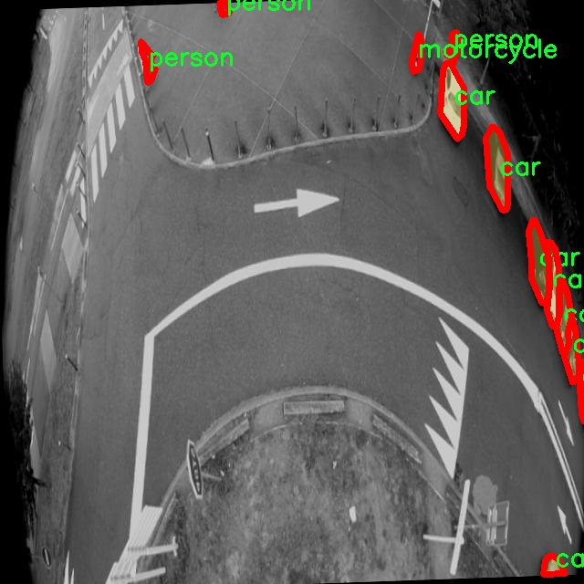
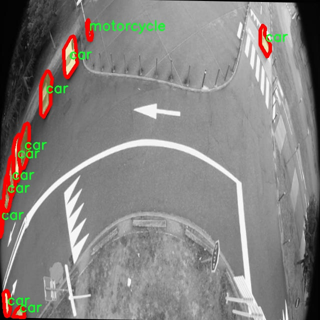
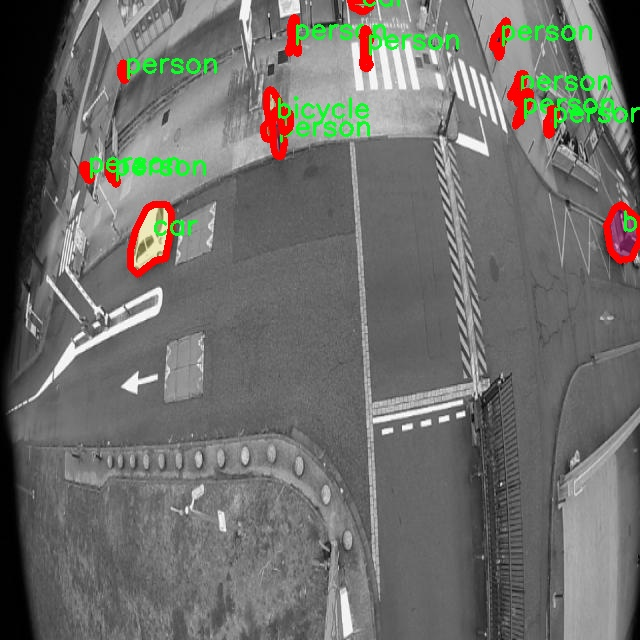

# 交通工具图像分割系统源码＆数据集分享
 [yolov8-seg-vanillanet＆yolov8-seg-C2f-Parc等50+全套改进创新点发刊_一键训练教程_Web前端展示]

### 1.研究背景与意义

项目参考[ILSVRC ImageNet Large Scale Visual Recognition Challenge](https://gitee.com/YOLOv8_YOLOv11_Segmentation_Studio/projects)

项目来源[AAAI Global Al lnnovation Contest](https://kdocs.cn/l/cszuIiCKVNis)

研究背景与意义

随着城市化进程的加快，交通工具的种类和数量不断增加，交通管理与安全问题日益突出。交通工具的高效识别与分割在智能交通系统、自动驾驶、城市规划等领域中具有重要的应用价值。传统的交通工具识别方法往往依赖于手工特征提取和简单的分类算法，难以满足复杂环境下的实时性和准确性要求。近年来，深度学习技术的迅猛发展为图像处理领域带来了新的机遇，尤其是基于卷积神经网络（CNN）的目标检测与分割算法，极大地提升了图像识别的性能。

YOLO（You Only Look Once）系列算法作为目标检测领域的佼佼者，以其快速且准确的特性受到广泛关注。YOLOv8作为该系列的最新版本，进一步优化了网络结构和算法性能，具备了更强的实时性和准确性。然而，尽管YOLOv8在目标检测方面表现出色，但在交通工具的图像分割任务中仍存在一定的局限性。尤其是在复杂背景、遮挡和多样化交通工具形态的情况下，现有模型的分割精度和鲁棒性仍需提升。因此，基于改进YOLOv8的交通工具图像分割系统的研究具有重要的理论和实践意义。

本研究将利用一个包含1700张图像的交通工具数据集，涵盖了8个类别：自行车、公交车、汽车、机器人、摩托车、行人、班车和卡车。这一数据集的多样性为模型的训练和验证提供了丰富的样本，能够有效提高模型的泛化能力。通过对YOLOv8进行改进，结合实例分割技术，旨在实现对不同交通工具的精准分割。这不仅能够提高交通工具的识别精度，还能为后续的行为分析、路径规划等提供基础数据支持。

此外，研究中将探讨数据增强、迁移学习等技术在模型训练中的应用，以进一步提升模型在复杂场景下的表现。通过对模型的系统性评估，分析其在不同交通工具类别和不同环境条件下的表现，旨在为智能交通系统的设计与优化提供理论依据和实践指导。

综上所述，基于改进YOLOv8的交通工具图像分割系统的研究，不仅能够推动交通工具识别技术的发展，还能为智能交通管理、自动驾驶技术的实现提供重要支持。随着智能交通系统的不断完善，未来的城市交通将更加高效、安全，研究成果将为社会的可持续发展贡献力量。

### 2.图片演示







##### 注意：由于此博客编辑较早，上面“2.图片演示”和“3.视频演示”展示的系统图片或者视频可能为老版本，新版本在老版本的基础上升级如下：（实际效果以升级的新版本为准）

  （1）适配了YOLOV8的“目标检测”模型和“实例分割”模型，通过加载相应的权重（.pt）文件即可自适应加载模型。

  （2）支持“图片识别”、“视频识别”、“摄像头实时识别”三种识别模式。

  （3）支持“图片识别”、“视频识别”、“摄像头实时识别”三种识别结果保存导出，解决手动导出（容易卡顿出现爆内存）存在的问题，识别完自动保存结果并导出到tempDir中。

  （4）支持Web前端系统中的标题、背景图等自定义修改，后面提供修改教程。

  另外本项目提供训练的数据集和训练教程,暂不提供权重文件（best.pt）,需要您按照教程进行训练后实现图片演示和Web前端界面演示的效果。

### 3.视频演示

[3.1 视频演示](https://www.bilibili.com/video/BV1DBDPYcE8B/)

### 4.数据集信息展示

##### 4.1 本项目数据集详细数据（类别数＆类别名）

nc: 6
names: ['bicycle', 'bus', 'car', 'motorcycle', 'person', 'truck']


##### 4.2 本项目数据集信息介绍

数据集信息展示

在本研究中，我们采用了名为“theo_auto”的数据集，以支持对YOLOv8-seg模型在交通工具图像分割任务中的改进和优化。该数据集专门设计用于交通工具的识别与分割，包含了多种交通工具的图像，旨在为计算机视觉领域提供高质量的训练样本。数据集的类别数量为六个，具体类别包括：自行车（bicycle）、公交车（bus）、小汽车（car）、摩托车（motorcycle）、行人（person）和卡车（truck）。这些类别涵盖了城市交通中常见的各种交通工具与行人，能够有效地反映现实世界中的交通场景。

“theo_auto”数据集的构建过程经过精心设计，确保了图像的多样性和代表性。每个类别的图像均来源于不同的城市环境、天气条件和时间段，确保模型在训练过程中能够学习到不同条件下的交通工具特征。例如，自行车和摩托车的图像可能在城市街道、骑行道或公园等场景中拍摄，而公交车和卡车则可能出现在公交站、交通繁忙的道路或货运区域。这种多样性不仅提高了模型的泛化能力，也使得模型在实际应用中能够更好地适应不同的环境。

数据集中的每个图像都经过精确的标注，确保每个交通工具和行人的轮廓清晰可见。这种精细的标注对于图像分割任务至关重要，因为它直接影响到模型的训练效果和最终的分割精度。通过使用先进的标注工具和技术，研究团队能够确保每个类别的图像标注准确无误，从而为YOLOv8-seg模型的训练提供了可靠的基础。

在数据集的构成上，类别的选择也经过深思熟虑。自行车、公交车、小汽车、摩托车、行人和卡车的组合不仅涵盖了常见的交通工具，还考虑到了不同交通工具之间的相互关系和场景中的动态变化。例如，行人与其他交通工具的相对位置、运动状态等因素都可能影响图像分割的效果。因此，研究团队在数据集的构建过程中，特别关注这些动态交互，以便模型能够更好地理解和处理复杂的交通场景。

此外，为了增强模型的鲁棒性，数据集还包括了不同的图像处理技术，如图像增强、噪声添加和光照变化等。这些技术的应用旨在模拟真实世界中可能遇到的各种情况，从而使模型在面对不确定性时能够保持较高的性能。这种数据集的设计理念与现代深度学习模型的训练需求高度契合，能够有效推动YOLOv8-seg在交通工具图像分割任务中的应用。

综上所述，“theo_auto”数据集为改进YOLOv8-seg的交通工具图像分割系统提供了丰富的资源和坚实的基础。通过多样化的类别、精确的标注和先进的数据处理技术，该数据集不仅为模型的训练提供了必要的支持，也为未来的研究和应用奠定了良好的基础。随着研究的深入，期待该数据集能够在交通工具识别与分割领域发挥更大的作用，推动智能交通系统的发展。











### 5.全套项目环境部署视频教程（零基础手把手教学）

[5.1 环境部署教程链接（零基础手把手教学）](https://www.bilibili.com/video/BV1jG4Ve4E9t/?vd_source=bc9aec86d164b67a7004b996143742dc)


[5.2 安装Python虚拟环境创建和依赖库安装视频教程链接（零基础手把手教学）](https://www.bilibili.com/video/BV1nA4VeYEze/?vd_source=bc9aec86d164b67a7004b996143742dc)

### 6.手把手YOLOV8-seg训练视频教程（零基础小白有手就能学会）

[6.1 手把手YOLOV8-seg训练视频教程（零基础小白有手就能学会）](https://www.bilibili.com/video/BV1cA4VeYETe/?vd_source=bc9aec86d164b67a7004b996143742dc)


按照上面的训练视频教程链接加载项目提供的数据集，运行train.py即可开始训练



     Epoch   gpu_mem       box       obj       cls    labels  img_size
     1/200     0G   0.01576   0.01955  0.007536        22      1280: 100%|██████████| 849/849 [14:42<00:00,  1.04s/it]
               Class     Images     Labels          P          R     mAP@.5 mAP@.5:.95: 100%|██████████| 213/213 [01:14<00:00,  2.87it/s]
                 all       3395      17314      0.994      0.957      0.0957      0.0843

     Epoch   gpu_mem       box       obj       cls    labels  img_size
     2/200     0G   0.01578   0.01923  0.007006        22      1280: 100%|██████████| 849/849 [14:44<00:00,  1.04s/it]
               Class     Images     Labels          P          R     mAP@.5 mAP@.5:.95: 100%|██████████| 213/213 [01:12<00:00,  2.95it/s]
                 all       3395      17314      0.996      0.956      0.0957      0.0845

     Epoch   gpu_mem       box       obj       cls    labels  img_size
     3/200     0G   0.01561    0.0191  0.006895        27      1280: 100%|██████████| 849/849 [10:56<00:00,  1.29it/s]
               Class     Images     Labels          P          R     mAP@.5 mAP@.5:.95: 100%|███████   | 187/213 [00:52<00:00,  4.04it/s]
                 all       3395      17314      0.996      0.957      0.0957      0.0845


### 7.50+种全套YOLOV8-seg创新点代码加载调参视频教程（一键加载写好的改进模型的配置文件）

[7.1 50+种全套YOLOV8-seg创新点代码加载调参视频教程（一键加载写好的改进模型的配置文件）](https://www.bilibili.com/video/BV1Hw4VePEXv/?vd_source=bc9aec86d164b67a7004b996143742dc)

### 8.YOLOV8-seg图像分割算法原理

原始YOLOv8-seg算法原理

YOLOv8-seg算法是YOLO系列中的最新版本，旨在进一步提升目标检测和分割的性能。该算法在YOLOv5和YOLOv7的基础上进行了优化，结合了多种先进的技术和结构，形成了一种高效、准确的目标检测和分割解决方案。YOLOv8-seg不仅继承了YOLO系列一贯的高速度和高精度特点，还在特征提取、特征融合以及损失函数等多个方面进行了创新。

首先，YOLOv8-seg的主干网络依然采用了CSPDarknet的设计理念，但在此基础上引入了C2f模块，替代了YOLOv5中的C3模块。C2f模块通过引入ELAN思想，优化了特征的流动和重用，使得网络在保持轻量化的同时，能够有效提升检测精度。C2f模块由多个CBS（卷积+归一化+SiLU激活）模块和多个Bottleneck组成，具有更丰富的梯度流信息。这种设计不仅提高了特征提取的能力，还解决了深层网络中常见的梯度消失和爆炸问题，增强了模型的收敛性。

在特征融合方面，YOLOv8-seg采用了PAN-FPN结构，旨在实现多尺度特征的有效融合。该结构通过自下而上的融合方式，将高层特征与中层和浅层特征进行结合，确保了不同层次的特征信息能够被充分利用。YOLOv8-seg在上采样阶段优化了特征的连接方式，直接将高层特征与中层特征进行拼接，避免了不必要的卷积操作，从而提升了特征融合的效率和准确性。

YOLOv8-seg的创新之处还体现在其Anchor-Free的设计理念上。传统的目标检测算法通常依赖于Anchor的设计，而YOLOv8-seg则抛弃了这一思路，采用了更为灵活的Anchor-Free方法。这一转变使得模型在处理不同尺寸和形状的目标时，能够更具适应性，提升了检测的准确性和效率。此外，YOLOv8-seg在样本匹配策略上也进行了改进，采用了Task-Aligned的Assigner匹配方式，进一步优化了目标检测的过程。

在损失函数的设计上，YOLOv8-seg引入了VFLLoss和DFLLoss+CIoULoss的组合，增强了分类和回归的效果。VFLLoss作为分类损失，能够有效处理样本不平衡的问题，而DFLLoss和CIoULoss则提升了边框回归的精度。这种损失函数的设计使得YOLOv8-seg在面对复杂场景时，能够更好地进行目标检测和分割。

在数据预处理方面，YOLOv8-seg延续了YOLOv5的策略，采用了马赛克增强、混合增强、空间扰动和颜色扰动等多种数据增强手段。这些技术的应用不仅丰富了训练数据的多样性，还有效提升了模型的鲁棒性，使其在实际应用中表现更加优异。

YOLOv8-seg的Head部分借鉴了YOLOX和YOLOv6的解耦头设计，取消了传统的objectness分支，通过边框回归和目标分类的解耦处理，进一步提升了检测的效率。Head部分输出的特征图经过处理后，能够提供多尺度的目标检测结果，确保了模型在不同分辨率下的检测能力。

综上所述，YOLOv8-seg算法通过在网络结构、特征融合、损失函数和数据处理等多个方面的创新，形成了一种高效、准确的目标检测和分割方案。其在处理复杂场景和多样化目标时，展现出了优越的性能，广泛适用于智能监控、自动驾驶和人脸识别等多种应用场景。随着YOLOv8-seg的推出，目标检测技术又向前迈进了一大步，为未来的研究和应用提供了更为强大的工具。


### 9.系统功能展示（检测对象为举例，实际内容以本项目数据集为准）

图9.1.系统支持检测结果表格显示

  图9.2.系统支持置信度和IOU阈值手动调节

  图9.3.系统支持自定义加载权重文件best.pt(需要你通过步骤5中训练获得)

  图9.4.系统支持摄像头实时识别

  图9.5.系统支持图片识别

  图9.6.系统支持视频识别

  图9.7.系统支持识别结果文件自动保存

  图9.8.系统支持Excel导出检测结果数据


### 10.50+种全套YOLOV8-seg创新点原理讲解（非科班也可以轻松写刊发刊，V11版本正在科研待更新）

#### 10.1 由于篇幅限制，每个创新点的具体原理讲解就不一一展开，具体见下列网址中的创新点对应子项目的技术原理博客网址【Blog】：


[10.1 50+种全套YOLOV8-seg创新点原理讲解链接](https://gitee.com/qunmasj/good)

#### 10.2 部分改进模块原理讲解(完整的改进原理见上图和技术博客链接)【如果此小节的图加载失败可以通过CSDN或者Github搜索该博客的标题访问原始博客，原始博客图片显示正常】
### YOLOv8简介
YOLOv8目标检测算法继承了YOLOv1系列的思考,是一种新型端到端的目标检测算法,尽管现在原始检测算法已经开源,但是鲜有发表的相关论文.YOLOv8的网络结构如图所示,主要可分为Input输入端、Backbone骨干神经网络、Neck 混合特征网络层和Head预测层网络共4个部分.

YOLO目标检测算法是一种端到端的One-Slage 目标检测算法，其核心思想是将图像按区域分块进行预测。YOLO将输入图像按照32x32的大小划分成若干个网格，例如416x416的图像将被划分为13x13个网格。当目标物体的中心位于某个网格内时,该网格就会负责输出该物体的边界框和类别置信度。每个网格可以预测多个边界框和多个目标类别,这些边界框和类别的数量可以根据需要进行设置。YOLO算法的输出是一个特征图,包含了每个网格对应的边界框和类别置信度的信息呵。本文采用YOLO最新的YOLOv8模型，其是2022年底发布的最新YOLO系列模型，采用全新的SOTA模型，全新的网络主干结构,如图1所示。
整个网络分为Backbone 骨干网络部分和Head头部网络部分。YOLOv8汲取了前几代网络的优秀特性，骨干网络和 Neck部分遵循CSP的思想，将YOLOv5中的C3模块被替换成了梯度流更丰富C2模块,去掉YOLOv5中 PAN-FPN上采样阶段中的卷积结构,将Backbone不同阶段输出的特征直接送入了上采样操作,模型提供了N/S/M/L/X尺度的不同大小模型,能够满足不同领域业界的需求。本文基于YOLOv8模型设计番茄病虫害检测系统，通过配置模型参数训练番茄图像,得到能够用于部署应用的最优模型。


### 感受野注意力卷积（RFAConv)
#### 标准卷积操作回顾
标准的卷积操作是构造卷积神经网络的基本构件。它利用具有共享参数的滑动窗口提取特征信息，克服了全连通层构造神经网络固有的参数多、计算开销大的问题。设 X R∈C×H×W
表示输入特征图，其中C、H、W分别表示特征图的通道数、高度、宽度。为了清楚地演示卷积核的特征提取过程，我们使用 C = 1 的例子。从每个接受域滑块中提取特征信息的卷积运算可以表示为:


这里，Fi 表示计算后每个卷积滑块得到的值，Xi 表示每个滑块内对应位置的像素值，K表示卷积核，S表示卷积核中的参数个数，N表示接收域滑块的总数。可以看出，每个滑块内相同位置的 feature共享相同的参数Ki。因此，标准的卷积运算并不能捕捉到不同位置所带来的信息差异，这最终在一定程度上限制了卷积神经网络的性能。 

#### 空间注意力回顾
目前，空间注意机制是利用学习得到的注意图来突出每个特征的重要性。与前一节类似，这里以 C=1为例。突出关键特征的空间注意机制可以简单表述为:这里，Fi 表示加权运算后得到的值。xi 和Ai 表示输入特征图和学习到的注意图在不同位置的值，N为输入特征图的高和宽的乘积，表示像素值的总数。


#### 空间注意与标准卷积运算
将注意力机制整合到卷积神经网络中，可以提高卷积神经网络的性能。通过对标准卷积运算和现有空间注意机制的研究，我们认为空间注意机制有效地克服了卷积神经网络固有的参数共享的局限性。目前卷积神经网络中最常用的核大小是 1 × 1和3 × 3。在引入空间注意机制后，提取特征的卷积操作可以是 1 × 1或3 × 3卷积操作。为了直观地展示这个过程，在 1 × 1卷积运算的前面插入了空间注意机制。通过注意图对输入特征图(Re-weight“×”)进行加权运算，最后通过 1 × 1卷积运算提取接收域的滑块特征信息。整个过程可以简单地表示如下:


 这里卷积核K仅代表一个参数值。如果取A i× ki 的值作为一种新的卷积核参数，有趣的是它解决了 1×1卷积运算提取特征时的参数共享问题。然而，关于空间注意机制的传说到此结束。当空间注意机制被插入到3×3卷积运算前面时。具体情况如下:


如上所述，如果取A的值 i × ki (4)式作为一种新的卷积核参数，完全解决了大规模卷积核的参数共享问题。然而，最重要的一点是，卷积核在提取每个接受域滑块的特征时，会共享一些特征。换句话说，每个接收域滑块内都有一个重叠。仔细分析后会发现A12= a21， a13 = a22， a15 = a24……，在这种情况下，每个滑动窗口共享空间注意力地图的权重。因此，空间注意机制没有考虑整个接受域的空间特征，不能有效地解决大规模卷积核的参数共享问题。因此，空间注意机制的有效性受到限制。 

#### 创新空间注意力和标准卷积操作
该博客提出解决了现有空间注意机制的局限性，为空间处理提供了一种创新的解决方案。受RFA的启发，一系列空间注意机制被开发出来，可以进一步提高卷积神经网络的性能。RFA可以看作是一个轻量级即插即用模块，RFA设计的卷积运算(RFAConv)可以代替标准卷积来提高卷积神经网络的性能。因此，我们预测空间注意机制与标准卷积运算的结合将继续发展，并在未来带来新的突破。
接受域空间特征:为了更好地理解接受域空间特征的概念，我们将提供相关的定义。接收域空间特征是专门为卷积核设计的，并根据核大小动态生成。如图1所示，以3×3卷积核为例。在图1中，“Spatial Feature”指的是原始的Feature map。“接受域空间特征”是空间特征变换后的特征图。

 

由不重叠的滑动窗口组成。当使用 3×3卷积内核提取特征时，接收域空间特征中的每个 3×3大小窗口代表一个接收域滑块。接受域注意卷积(RFAConv):针对接受域的空间特征，我们提出了接受域注意卷积(RFA)。该方法不仅强调了接收域滑块内不同特征的重要性，而且对接收域空间特征进行了优先排序。通过该方法，完全解决了卷积核参数共享的问题。接受域空间特征是根据卷积核的大小动态生成的，因此，RFA是卷积的固定组合，不能与卷积操作的帮助分离，卷积操作同时依赖于RFA来提高性能，因此我们提出了接受场注意卷积(RFAConv)。具有3×3大小的卷积核的RFAConv整体结构如图所示。


目前，最广泛使用的接受域特征提取方法是缓慢的。经过大量的研究，我们开发了一种快速的方法，用分组卷积来代替原来的方法。具体来说，我们利用相应大小的分组卷积来动态生成基于接受域大小的展开特征。尽管与原始的无参数方法(如PyTorch提供的nn.())相比，该方法增加了一些参数，但它的速度要快得多。注意:如前一节所述，当使用 3×3卷积内核提取特征时，接收域空间特征中的每个 3×3大小窗口表示一个接收域滑块。而利用快速分组卷积提取感受野特征后，将原始特征映射为新的特征。最近的研究表明。交互信息可以提高网络性能，如[40,41,42]所示。同样，对于RFAConv来说，通过交互接受域特征信息来学习注意图可以提高网络性能。然而，与每个接收域特征交互会导致额外的计算开销，因此为了最小化计算开销和参数的数量，我们使用AvgPool来聚合每个接收域特征的全局信息。然后，使用 1×1 组卷积操作进行信息交互。最后，我们使用softmax来强调每个特征在接受域特征中的重要性。一般情况下，RFA的计算可以表示为:


这里gi×i 表示一个大小为 i×i的分组卷积，k表示卷积核的大小，Norm表示归一化，X表示输入的特征图，F由注意图 a相乘得到 rf 与转换后的接受域空间特征 Frf。与CBAM和CA不同，RFA能够为每个接受域特征生成注意图。卷积神经网络的性能受到标准卷积操作的限制，因为卷积操作依赖于共享参数，对位置变化带来的信息差异不敏感。然而，RFAConv通过强调接收域滑块中不同特征的重要性，并对接收域空间特征进行优先级排序，可以完全解决这个问题。通过RFA得到的feature map是接受域空间特征，在“Adjust Shape”后没有重叠。因此，学习到的注意图将每个接受域滑块的特征信息聚合起来。换句话说，注意力地图不再共享在每个接受域滑块。这完全弥补了现有 CA和CBAM注意机制的不足。RFA为标准卷积内核提供了显著的好处。而在调整形状后，特征的高度和宽度是 k倍，需要进行 stride = k的k × k卷积运算来提取特征信息。RFA设计的卷积运算RFAConv为卷积带来了良好的增益，对标准卷积进行了创新。
此外，我们认为现有的空间注意机制应该优先考虑接受域空间特征，以提高网络性能。众所周知，基于自注意机制的网络模型[43,44,45]取得了很大的成功，因为它解决了卷积参数共享的问题，并对远程信息进行建模。然而，自注意机制也为模型引入了显著的计算开销和复杂性。我们认为，将现有的空间注意机制的注意力引导到接受场空间特征上，可以以类似于自我注意的方式解决长期信息的参数共享和建模问题。与自我关注相比，这种方法需要的参数和计算资源少得多。答案如下:(1)将以接收场空间特征为中心的空间注意机制与卷积相结合，消除了卷积参数共享的问题。(2)现有的空间注意机制已经考虑了远程信息，可以通过全局平均池或全局最大池的方式获取全局信息，其中明确考虑了远程信息。因此，我们设计了新的 CBAM和CA模型，称为RFCBAM和RFCA，它们专注于接受域空间特征。与RFA类似，使用最终的k × k stride = k 的卷积运算来提取特征信息。这两种新的卷积方法的具体结构如图 3所示，我们称这两种新的卷积操作为 RFCBAMConv和RFCAConv。与原来的CBAM相比，我们在RFCBAM中使用SE attention来代替CAM。因为这样可以减少计算开销。此外，在RFCBAM中，通道注意和空间注意不是分开执行的。相反，它们是同时加权的，使得每个通道获得的注意力地图是不同的。


### 11.项目核心源码讲解（再也不用担心看不懂代码逻辑）

#### 11.1 ultralytics\nn\modules\head.py

以下是对代码中最核心部分的分析和详细中文注释：

```python
import torch
import torch.nn as nn
from .conv import Conv
from .utils import bias_init_with_prob, linear_init_

class Detect(nn.Module):
    """YOLOv8 检测头，用于目标检测模型。"""
    
    def __init__(self, nc=80, ch=()):
        """初始化 YOLOv8 检测层，指定类别数和通道数。
        
        参数:
        nc (int): 类别数，默认为 80。
        ch (tuple): 输入通道数的元组。
        """
        super().__init__()
        self.nc = nc  # 类别数
        self.nl = len(ch)  # 检测层的数量
        self.reg_max = 16  # DFL 通道数
        self.no = nc + self.reg_max * 4  # 每个锚点的输出数量
        self.stride = torch.zeros(self.nl)  # 在构建过程中计算的步幅
        
        # 定义卷积层
        c2, c3 = max((16, ch[0] // 4, self.reg_max * 4)), max(ch[0], min(self.nc, 100))  # 通道数
        self.cv2 = nn.ModuleList(
            nn.Sequential(Conv(x, c2, 3), Conv(c2, c2, 3), nn.Conv2d(c2, 4 * self.reg_max, 1)) for x in ch)
        self.cv3 = nn.ModuleList(nn.Sequential(Conv(x, c3, 3), Conv(c3, c3, 3), nn.Conv2d(c3, self.nc, 1)) for x in ch)
        self.dfl = DFL(self.reg_max) if self.reg_max > 1 else nn.Identity()  # DFL层

    def forward(self, x):
        """连接并返回预测的边界框和类别概率。
        
        参数:
        x (list): 输入特征图的列表。
        
        返回:
        y (tensor): 预测的边界框和类别概率。
        """
        shape = x[0].shape  # BCHW
        for i in range(self.nl):
            x[i] = torch.cat((self.cv2[i](x[i]), self.cv3[i](x[i])), 1)  # 合并特征图
        
        # 训练模式下直接返回
        if self.training:
            return x
        
        # 动态模式或形状变化时更新锚点和步幅
        if self.dynamic or self.shape != shape:
            self.anchors, self.strides = (x.transpose(0, 1) for x in make_anchors(x, self.stride, 0.5))
            self.shape = shape

        # 将所有层的输出合并
        x_cat = torch.cat([xi.view(shape[0], self.no, -1) for xi in x], 2)
        box, cls = x_cat.split((self.reg_max * 4, self.nc), 1)  # 分割边界框和类别概率
        dbox = dist2bbox(self.dfl(box), self.anchors.unsqueeze(0), xywh=True, dim=1) * self.strides  # 解码边界框

        # 归一化边界框
        img_h = shape[2] * self.stride[0]
        img_w = shape[3] * self.stride[0]
        img_size = torch.tensor([img_w, img_h, img_w, img_h], device=dbox.device).reshape(1, 4, 1)
        dbox /= img_size

        # 返回最终结果
        y = torch.cat((dbox, cls.sigmoid()), 1)  # 合并边界框和类别概率
        return y if self.export else (y, x)

    def bias_init(self):
        """初始化 Detect() 的偏置，警告：需要步幅可用。"""
        m = self  # self.model[-1]  # Detect() 模块
        for a, b, s in zip(m.cv2, m.cv3, m.stride):  # 遍历每个卷积层
            a[-1].bias.data[:] = 1.0  # 边界框偏置初始化
            b[-1].bias.data[:m.nc] = math.log(5 / m.nc / (640 / s) ** 2)  # 类别偏置初始化

# 其他类（Segment, Pose, Classify, RTDETRDecoder）可以根据需要进行类似的简化和注释。
```

在这个代码片段中，`Detect` 类是 YOLOv8 模型的核心部分，负责处理输入特征图并输出边界框和类别概率。构造函数中定义了必要的卷积层和参数，而 `forward` 方法则实现了前向传播逻辑。代码中的注释详细解释了每个部分的功能和目的，便于理解和维护。

该文件是Ultralytics YOLOv8模型的头部模块，主要负责目标检测、分割、姿态估计和分类等任务的实现。文件中定义了多个类，每个类对应不同的任务头部，具体分析如下。

首先，`Detect`类是YOLOv8的检测头，负责处理目标检测任务。它的构造函数接收类别数量和通道数，并初始化了一些参数，包括每个锚框的输出数量、卷积层等。在`forward`方法中，输入的特征图经过卷积层处理后，生成边界框和类别概率。该方法还处理了动态锚框的生成和输出格式的调整，以适应不同的导出模式。

接下来是`Segment`类，继承自`Detect`类，专门用于图像分割任务。它增加了对掩膜和原型的处理，构造函数中定义了掩膜数量和原型数量。在`forward`方法中，除了调用父类的`forward`方法外，还计算了掩膜系数，并在训练和推理阶段返回不同的输出。

`Pose`类同样继承自`Detect`类，主要用于姿态估计任务。它的构造函数定义了关键点的形状，并在`forward`方法中处理关键点的预测。该类的关键点解码逻辑在`kpts_decode`方法中实现，负责将模型输出的关键点坐标转换为实际的坐标值。

`Classify`类是YOLOv8的分类头，负责将输入的特征图转换为类别概率。它使用卷积层和全局平均池化层，并通过线性层输出最终的分类结果。

最后，`RTDETRDecoder`类实现了实时可变形Transformer解码器，结合了Transformer架构和可变形卷积，负责从多个层的特征中预测边界框和类别标签。该类的构造函数接收多个参数以配置解码器的结构，包括隐藏层维度、查询数量、解码层数量等。在`forward`方法中，输入特征经过编码器处理后，生成解码器所需的输入，并最终输出边界框和分类分数。

整体来看，这个文件实现了YOLOv8模型的多个任务头部，使用了现代深度学习中的卷积层、Transformer等技术，旨在提高目标检测、分割和分类的性能。每个类的设计都考虑了不同任务的需求，提供了灵活的接口以适应训练和推理的不同场景。

#### 11.2 ultralytics\nn\extra_modules\ops_dcnv3\modules\__init__.py

以下是代码中最核心的部分，并附上详细的中文注释：

```python
# 导入所需的模块
from .dcnv3 import DCNv3, DCNv3_pytorch, DCNv3_DyHead

# 这里的代码从当前包（.）中导入了三个类或函数：
# 1. DCNv3：可能是一个深度可分离卷积网络的实现。
# 2. DCNv3_pytorch：可能是针对PyTorch框架的DCNv3实现。
# 3. DCNv3_DyHead：可能是一个动态头部（Dynamic Head）的实现，通常用于目标检测等任务。

# 这些导入的模块可能会在后续的代码中被用于构建神经网络模型或进行特定的计算。
```

以上是代码的核心部分及其详细注释。

这个程序文件是一个Python模块的初始化文件，位于`ultralytics/nn/extra_modules/ops_dcnv3/modules/`目录下。文件的开头包含了一些版权信息，表明该代码属于OpenGVLab，并且遵循MIT许可证，这意味着用户可以自由使用、修改和分发该代码，只要遵循许可证的条款。

在文件的主体部分，使用了`from ... import ...`语句来导入其他模块中的类或函数。具体来说，这里导入了三个对象：`DCNv3`、`DCNv3_pytorch`和`DCNv3_DyHead`，它们都来自于同一目录下的`dcnv3`模块。这种导入方式使得在使用这个模块时，可以直接访问这些对象，而不需要每次都指定完整的模块路径。

`DCNv3`可能是一个实现了某种深度可分离卷积的类，而`DCNv3_pytorch`和`DCNv3_DyHead`则可能是与PyTorch框架相关的实现或扩展。这些类或函数的具体功能和实现细节需要查看`dcnv3`模块中的代码来进一步了解。

总的来说，这个初始化文件的主要作用是将特定的功能模块导入到当前包中，以便于在其他地方使用。

#### 11.3 ultralytics\models\yolo\__init__.py

以下是经过简化并添加详细中文注释的核心代码部分：

```python
# 导入Ultralytics YOLO模型库中的分类、检测、姿态估计和分割功能
from ultralytics.models.yolo import classify, detect, pose, segment

# 从当前模块导入YOLO模型类
from .model import YOLO

# 定义当前模块公开的接口，包含分类、分割、检测、姿态估计功能及YOLO模型类
__all__ = 'classify', 'segment', 'detect', 'pose', 'YOLO'
```

### 代码注释说明：

1. **导入模型功能**：
   - `from ultralytics.models.yolo import classify, detect, pose, segment`：这行代码从`ultralytics`库中导入了YOLO模型的四个主要功能模块：分类（classify）、检测（detect）、姿态估计（pose）和分割（segment）。这些功能是YOLO模型的核心应用，用于处理不同类型的计算机视觉任务。

2. **导入YOLO模型类**：
   - `from .model import YOLO`：这行代码从当前模块的`model`文件中导入了YOLO模型类。这个类通常用于创建YOLO模型的实例，以便进行训练或推理。

3. **定义模块接口**：
   - `__all__ = 'classify', 'segment', 'detect', 'pose', 'YOLO'`：这行代码定义了当前模块的公开接口。通过`__all__`，可以指定在使用`from module import *`时，哪些名称是可以被导入的。这有助于控制模块的可见性，避免不必要的名称冲突。

这个简化后的代码保留了核心功能，同时通过注释解释了每一部分的作用。

这个程序文件是Ultralytics YOLO模型的初始化文件，文件名为`__init__.py`，它的主要作用是定义模块的公共接口。在这个文件中，首先通过注释标明了项目的名称“Ultralytics YOLO”以及使用的许可证类型（AGPL-3.0）。接下来，文件从`ultralytics.models.yolo`模块中导入了四个功能：`classify`（分类）、`detect`（检测）、`pose`（姿态估计）和`segment`（分割）。这些功能代表了YOLO模型在不同任务上的应用。

此外，文件还从当前目录下的`model`模块中导入了`YOLO`类。最后，通过`__all__`变量定义了模块的公共接口，列出了可以被外部访问的名称，包括`classify`、`segment`、`detect`、`pose`和`YOLO`。这样做的目的是为了在使用`from ultralytics.models.yolo import *`时，明确哪些对象是可以被导入的，从而避免不必要的名称冲突和提高代码的可读性。整体来看，这个文件为YOLO模型的不同功能提供了一个清晰的入口。

#### 11.4 demo_test_camera.py

以下是代码中最核心的部分，并附上详细的中文注释：

```python
import cv2
import numpy as np
from PIL import ImageFont, ImageDraw, Image
from hashlib import md5
from model import Web_Detector
from chinese_name_list import Label_list

def generate_color_based_on_name(name):
    # 使用哈希函数生成稳定的颜色
    hash_object = md5(name.encode())  # 对名字进行MD5哈希
    hex_color = hash_object.hexdigest()[:6]  # 取前6位16进制数作为颜色值
    r, g, b = int(hex_color[0:2], 16), int(hex_color[2:4], 16), int(hex_color[4:6], 16)  # 转换为RGB
    return (b, g, r)  # OpenCV 使用BGR格式

def draw_with_chinese(image, text, position, font_size=20, color=(255, 0, 0)):
    # 在图像上绘制中文文本
    image_pil = Image.fromarray(cv2.cvtColor(image, cv2.COLOR_BGR2RGB))  # 转换为PIL格式
    draw = ImageDraw.Draw(image_pil)  # 创建绘图对象
    font = ImageFont.truetype("simsun.ttc", font_size, encoding="unic")  # 加载中文字体
    draw.text(position, text, font=font, fill=color)  # 绘制文本
    return cv2.cvtColor(np.array(image_pil), cv2.COLOR_RGB2BGR)  # 转换回OpenCV格式

def draw_detections(image, info):
    # 绘制检测结果，包括边框、类别名称等
    name, bbox = info['class_name'], info['bbox']  # 获取类别名称和边界框
    x1, y1, x2, y2 = bbox  # 解包边界框坐标
    cv2.rectangle(image, (x1, y1), (x2, y2), color=(0, 0, 255), thickness=3)  # 绘制边界框
    image = draw_with_chinese(image, name, (x1, y1 - 10), font_size=20)  # 绘制类别名称
    return image

def process_frame(model, image):
    # 处理每一帧图像
    pre_img = model.preprocess(image)  # 预处理图像
    pred = model.predict(pre_img)  # 进行预测
    det = pred[0]  # 获取检测结果

    if det is not None and len(det):
        det_info = model.postprocess(pred)  # 后处理，获取检测信息
        for info in det_info:
            image = draw_detections(image, info)  # 绘制检测结果
    return image

if __name__ == "__main__":
    model = Web_Detector()  # 创建模型实例
    model.load_model("./weights/yolov8s-seg.pt")  # 加载模型权重

    # 摄像头实时处理
    cap = cv2.VideoCapture(0)  # 打开摄像头
    while cap.isOpened():
        ret, frame = cap.read()  # 读取一帧
        if not ret:
            break
        processed_frame = process_frame(model, frame)  # 处理帧
        cv2.imshow('Camera Feed', processed_frame)  # 显示处理后的帧
        if cv2.waitKey(1) & 0xFF == ord('q'):  # 按'q'退出
            break
    cap.release()  # 释放摄像头
    cv2.destroyAllWindows()  # 关闭所有窗口
```

### 代码核心部分说明：
1. **生成颜色**：`generate_color_based_on_name` 函数使用MD5哈希算法生成与名字对应的颜色，以确保同一个名字每次生成的颜色一致。
2. **绘制中文文本**：`draw_with_chinese` 函数使用PIL库在图像上绘制中文文本，确保中文字符能够正确显示。
3. **绘制检测结果**：`draw_detections` 函数负责在图像上绘制检测到的物体的边界框和类别名称。
4. **处理每一帧**：`process_frame` 函数对每一帧图像进行预处理、预测和后处理，最终返回绘制了检测结果的图像。
5. **实时摄像头处理**：在主程序中，打开摄像头并实时读取帧，处理后显示，按下'q'键可退出。

这个程序文件`demo_test_camera.py`的主要功能是通过摄像头实时捕捉视频流，并对每一帧进行目标检测和分割，最后将检测到的目标以边框和文字的形式显示在视频上。以下是对代码的详细说明。

首先，程序导入了一些必要的库，包括`random`、`cv2`（OpenCV库）、`numpy`、`PIL`（用于处理图像）、`hashlib`（用于生成哈希值）以及自定义的`Web_Detector`模型和`Label_list`类。

接下来，定义了几个辅助函数。`generate_color_based_on_name(name)`函数使用MD5哈希算法根据目标名称生成一个稳定的颜色，以便在图像中绘制时保持一致。`calculate_polygon_area(points)`函数用于计算多边形的面积，使用OpenCV的`contourArea`方法。`draw_with_chinese(image, text, position, font_size=20, color=(255, 0, 0))`函数则是将中文文本绘制到图像上，使用了PIL库来处理中文字体。

`adjust_parameter(image_size, base_size=1000)`函数根据图像的大小调整参数，以便在不同分辨率下保持绘制效果的一致性。`draw_detections(image, info, alpha=0.2)`函数是核心部分，它负责在图像上绘制检测到的目标，包括边框、类别名称、面积、周长、圆度和颜色值等信息。这个函数首先获取目标的相关信息，然后根据是否有掩膜（mask）来决定绘制方式。如果没有掩膜，就简单地绘制边框和类别名称；如果有掩膜，则会填充多边形并计算相关的几何特征和颜色信息。

`process_frame(model, image)`函数用于处理每一帧图像，首先对图像进行预处理，然后通过模型进行预测，最后将检测到的目标信息传递给`draw_detections`函数进行绘制。

在主程序部分，首先加载目标检测模型，并打开摄像头进行实时视频捕捉。通过一个循环不断读取摄像头的帧，调用`process_frame`函数处理每一帧，并使用OpenCV的`imshow`函数显示处理后的图像。如果用户按下“q”键，程序将退出循环，释放摄像头资源并关闭所有窗口。

总体来说，这个程序实现了一个实时目标检测和分割的应用，能够在视频流中识别并标注出不同的目标，适用于各种计算机视觉任务。

#### 11.5 ultralytics\models\sam\predict.py

以下是经过简化和注释的核心代码部分，主要集中在`Predictor`类及其关键方法上：

```python
import numpy as np
import torch
import torch.nn.functional as F
import torchvision

class Predictor:
    """
    Predictor类用于Segment Anything Model (SAM)的推理，专注于图像分割任务。
    该类支持多种提示类型，如边界框、点和低分辨率掩码。
    """

    def __init__(self, cfg, overrides=None):
        """
        初始化Predictor，设置配置和覆盖参数。
        Args:
            cfg (dict): 配置字典。
            overrides (dict, optional): 覆盖默认配置的值。
        """
        if overrides is None:
            overrides = {}
        overrides.update(dict(task='segment', mode='predict', imgsz=1024))
        self.cfg = cfg
        self.args = overrides
        self.im = None  # 预处理后的输入图像
        self.features = None  # 提取的图像特征
        self.prompts = {}  # 存储提示信息
        self.segment_all = False  # 控制是否分割所有对象

    def preprocess(self, im):
        """
        预处理输入图像以供模型推理。
        Args:
            im (torch.Tensor | List[np.ndarray]): 输入图像，支持BCHW格式或HWC格式的numpy数组列表。
        Returns:
            (torch.Tensor): 预处理后的图像张量。
        """
        if self.im is not None:
            return self.im
        not_tensor = not isinstance(im, torch.Tensor)
        if not_tensor:
            im = np.stack(self.pre_transform(im))
            im = im[..., ::-1].transpose((0, 3, 1, 2))  # 转换为CHW格式
            im = torch.from_numpy(im)

        im = im.to(self.device)  # 移动到指定设备
        im = im.half() if self.model.fp16 else im.float()  # 根据模型设置选择数据类型
        if not_tensor:
            im = (im - self.mean) / self.std  # 归一化
        return im

    def inference(self, im, bboxes=None, points=None, masks=None, multimask_output=False):
        """
        执行图像分割推理。
        Args:
            im (torch.Tensor): 预处理后的输入图像。
            bboxes (np.ndarray | List, optional): 边界框。
            points (np.ndarray | List, optional): 指示对象位置的点。
            masks (np.ndarray, optional): 低分辨率掩码。
            multimask_output (bool, optional): 是否返回多个掩码。
        Returns:
            (tuple): 包含输出掩码、质量分数和低分辨率logits的元组。
        """
        # 使用存储的提示覆盖输入参数
        bboxes = self.prompts.pop('bboxes', bboxes)
        points = self.prompts.pop('points', points)
        masks = self.prompts.pop('masks', masks)

        if all(i is None for i in [bboxes, points, masks]):
            return self.generate(im)  # 如果没有提示，生成掩码

        return self.prompt_inference(im, bboxes, points, masks, multimask_output)

    def prompt_inference(self, im, bboxes=None, points=None, masks=None, multimask_output=False):
        """
        基于提示进行图像分割推理。
        Args:
            im (torch.Tensor): 预处理后的输入图像。
            bboxes (np.ndarray | List, optional): 边界框。
            points (np.ndarray | List, optional): 指示对象位置的点。
            masks (np.ndarray, optional): 低分辨率掩码。
            multimask_output (bool, optional): 是否返回多个掩码。
        Returns:
            (tuple): 包含输出掩码、质量分数和低分辨率logits的元组。
        """
        features = self.model.image_encoder(im) if self.features is None else self.features

        # 处理输入提示
        if points is not None:
            points = torch.as_tensor(points, dtype=torch.float32, device=self.device)
            points = points[None] if points.ndim == 1 else points
            labels = torch.ones(points.shape[0], dtype=torch.int32, device=self.device)  # 默认标签为1

        if bboxes is not None:
            bboxes = torch.as_tensor(bboxes, dtype=torch.float32, device=self.device)

        # 嵌入提示并预测掩码
        sparse_embeddings, dense_embeddings = self.model.prompt_encoder(points=points, boxes=bboxes, masks=masks)
        pred_masks, pred_scores = self.model.mask_decoder(
            image_embeddings=features,
            sparse_prompt_embeddings=sparse_embeddings,
            dense_prompt_embeddings=dense_embeddings,
            multimask_output=multimask_output,
        )

        return pred_masks.flatten(0, 1), pred_scores.flatten(0, 1)  # 返回展平的掩码和分数

    def generate(self, im):
        """
        使用SAM进行图像分割。
        Args:
            im (torch.Tensor): 输入图像张量。
        Returns:
            (tuple): 包含分割掩码、置信度分数和边界框的元组。
        """
        self.segment_all = True
        # 这里省略了图像裁剪和处理的细节
        # 返回生成的掩码、分数和边界框
        return pred_masks, pred_scores, pred_bboxes

    def setup_model(self, model):
        """
        初始化SAM模型以进行推理。
        Args:
            model (torch.nn.Module): 预训练的SAM模型。
        """
        self.model = model.to(self.device)  # 将模型移动到指定设备
        self.mean = torch.tensor([123.675, 116.28, 103.53]).view(-1, 1, 1).to(self.device)  # 归一化均值
        self.std = torch.tensor([58.395, 57.12, 57.375]).view(-1, 1, 1).to(self.device)  # 归一化标准差

    def postprocess(self, preds, img, orig_imgs):
        """
        后处理SAM的推理输出，生成对象检测掩码和边界框。
        Args:
            preds (tuple): SAM模型推理的输出。
            img (torch.Tensor): 处理后的输入图像张量。
            orig_imgs (list | torch.Tensor): 原始未处理的图像。
        Returns:
            (list): 包含检测掩码、边界框和其他元数据的结果列表。
        """
        pred_masks, pred_scores = preds[:2]
        results = []
        for i, masks in enumerate([pred_masks]):
            orig_img = orig_imgs[i]
            masks = masks > self.model.mask_threshold  # 应用阈值
            results.append({'masks': masks, 'scores': pred_scores})  # 返回结果
        return results
```

### 代码说明
1. **类和初始化**：`Predictor`类用于图像分割任务，初始化时设置配置和覆盖参数。
2. **预处理**：`preprocess`方法负责将输入图像转换为模型可接受的格式，并进行归一化处理。
3. **推理**：`inference`方法执行图像分割推理，支持多种提示类型。
4. **提示推理**：`prompt_inference`方法处理具体的推理逻辑，包括对输入提示的处理和掩码的预测。
5. **生成掩码**：`generate`方法负责使用SAM模型生成分割掩码。
6. **模型设置**：`setup_model`方法用于初始化和配置SAM模型。
7. **后处理**：`postprocess`方法将模型输出转换为最终的检测结果，包括掩码和边界框。

以上代码保留了核心功能并进行了详细注释，以便于理解和使用。

这个程序文件是一个用于实现“Segment Anything Model”（SAM）预测的模块，属于Ultralytics框架的一部分。该模块主要用于图像分割任务，利用SAM模型的先进架构，支持灵活的提示（如边界框、点和低分辨率掩码）来进行实时分割。

文件中首先导入了一些必要的库，包括NumPy、PyTorch和Torchvision等。接着，定义了一个`Predictor`类，该类继承自`BasePredictor`，用于执行图像分割的推理。类的构造函数初始化了一些属性，包括配置字典、覆盖的参数、回调函数等，并设置了一些特定于任务的设置，如启用`retina_masks`以获得最佳结果。

`preprocess`方法用于对输入图像进行预处理，包括应用变换和归一化。该方法支持两种输入格式：Torch张量和NumPy数组列表。`pre_transform`方法则负责对输入图像进行初步变换，确保图像尺寸符合模型要求。

`inference`方法是执行图像分割推理的核心函数，接收预处理后的图像和各种提示（如边界框、点、掩码等），并利用SAM的架构进行实时分割。如果没有提供提示，方法会调用`generate`方法进行全图分割。

`generate`方法通过SAM的高级架构对整个图像进行分割，支持对图像进行裁剪以实现更精细的分割。该方法还可以设置多个参数来控制裁剪的层数、重叠比例、置信度阈值等。

`setup_model`方法用于初始化SAM模型，将其分配到适当的设备，并设置图像归一化所需的参数。`postprocess`方法则对模型的输出进行后处理，生成对象检测掩码和边界框，并将掩码和框缩放到原始图像大小。

此外，`setup_source`和`set_image`方法用于配置推理的数据源，确保只处理单张图像。`set_prompts`方法允许用户提前设置提示，而`reset_image`方法则重置图像和特征。

最后，`remove_small_regions`方法用于对生成的分割掩码进行后处理，移除小的、不连通的区域和孔，并通过非极大值抑制（NMS）消除重复的边界框。

整体而言，这个文件实现了一个高效的图像分割预测模块，利用SAM模型的强大能力，支持多种输入提示方式，适用于实时图像分割任务。

### 12.系统整体结构（节选）

### 程序整体功能和构架概括

该程序是一个基于Ultralytics框架的计算机视觉应用，主要实现了目标检测、分割和姿态估计等功能。它结合了YOLO模型和Segment Anything Model（SAM），提供了实时图像处理能力。程序的架构模块化，便于扩展和维护。各个模块之间通过明确的接口进行交互，支持多种输入格式和提示方式，能够灵活应对不同的计算机视觉任务。

### 文件功能整理表

| 文件路径                                         | 功能描述                                                                                     |
|--------------------------------------------------|----------------------------------------------------------------------------------------------|
| `ultralytics/nn/modules/head.py`                | 实现YOLOv8模型的头部模块，负责目标检测、分割、姿态估计和分类任务的处理。                    |
| `ultralytics/nn/extra_modules/ops_dcnv3/modules/__init__.py` | 初始化模块，导入深度可分离卷积DCNv3及其相关实现，提供额外的卷积操作支持。                     |
| `ultralytics/models/yolo/__init__.py`           | 定义YOLO模型的公共接口，导入分类、检测、姿态估计和分割功能，提供统一的访问入口。              |
| `demo_test_camera.py`                            | 实现实时目标检测和分割的应用，通过摄像头捕捉视频流并对每一帧进行处理，显示检测结果。          |
| `ultralytics/models/sam/predict.py`             | 实现Segment Anything Model的预测功能，支持多种输入提示方式进行图像分割，提供推理和后处理功能。 |

这个表格总结了每个文件的主要功能，帮助理解整个程序的结构和各个模块的作用。

注意：由于此博客编辑较早，上面“11.项目核心源码讲解（再也不用担心看不懂代码逻辑）”中部分代码可能会优化升级，仅供参考学习，完整“训练源码”、“Web前端界面”和“50+种创新点源码”以“14.完整训练+Web前端界面+50+种创新点源码、数据集获取”的内容为准。

### 13.图片、视频、摄像头图像分割Demo(去除WebUI)代码

在这个博客小节中，我们将讨论如何在不使用WebUI的情况下，实现图像分割模型的使用。本项目代码已经优化整合，方便用户将分割功能嵌入自己的项目中。
核心功能包括图片、视频、摄像头图像的分割，ROI区域的轮廓提取、类别分类、周长计算、面积计算、圆度计算以及颜色提取等。
这些功能提供了良好的二次开发基础。

### 核心代码解读

以下是主要代码片段，我们会为每一块代码进行详细的批注解释：

```python
import random
import cv2
import numpy as np
from PIL import ImageFont, ImageDraw, Image
from hashlib import md5
from model import Web_Detector
from chinese_name_list import Label_list

# 根据名称生成颜色
def generate_color_based_on_name(name):
    ......

# 计算多边形面积
def calculate_polygon_area(points):
    return cv2.contourArea(points.astype(np.float32))

...
# 绘制中文标签
def draw_with_chinese(image, text, position, font_size=20, color=(255, 0, 0)):
    image_pil = Image.fromarray(cv2.cvtColor(image, cv2.COLOR_BGR2RGB))
    draw = ImageDraw.Draw(image_pil)
    font = ImageFont.truetype("simsun.ttc", font_size, encoding="unic")
    draw.text(position, text, font=font, fill=color)
    return cv2.cvtColor(np.array(image_pil), cv2.COLOR_RGB2BGR)

# 动态调整参数
def adjust_parameter(image_size, base_size=1000):
    max_size = max(image_size)
    return max_size / base_size

# 绘制检测结果
def draw_detections(image, info, alpha=0.2):
    name, bbox, conf, cls_id, mask = info['class_name'], info['bbox'], info['score'], info['class_id'], info['mask']
    adjust_param = adjust_parameter(image.shape[:2])
    spacing = int(20 * adjust_param)

    if mask is None:
        x1, y1, x2, y2 = bbox
        aim_frame_area = (x2 - x1) * (y2 - y1)
        cv2.rectangle(image, (x1, y1), (x2, y2), color=(0, 0, 255), thickness=int(3 * adjust_param))
        image = draw_with_chinese(image, name, (x1, y1 - int(30 * adjust_param)), font_size=int(35 * adjust_param))
        y_offset = int(50 * adjust_param)  # 类别名称上方绘制，其下方留出空间
    else:
        mask_points = np.concatenate(mask)
        aim_frame_area = calculate_polygon_area(mask_points)
        mask_color = generate_color_based_on_name(name)
        try:
            overlay = image.copy()
            cv2.fillPoly(overlay, [mask_points.astype(np.int32)], mask_color)
            image = cv2.addWeighted(overlay, 0.3, image, 0.7, 0)
            cv2.drawContours(image, [mask_points.astype(np.int32)], -1, (0, 0, 255), thickness=int(8 * adjust_param))

            # 计算面积、周长、圆度
            area = cv2.contourArea(mask_points.astype(np.int32))
            perimeter = cv2.arcLength(mask_points.astype(np.int32), True)
            ......

            # 计算色彩
            mask = np.zeros(image.shape[:2], dtype=np.uint8)
            cv2.drawContours(mask, [mask_points.astype(np.int32)], -1, 255, -1)
            color_points = cv2.findNonZero(mask)
            ......

            # 绘制类别名称
            x, y = np.min(mask_points, axis=0).astype(int)
            image = draw_with_chinese(image, name, (x, y - int(30 * adjust_param)), font_size=int(35 * adjust_param))
            y_offset = int(50 * adjust_param)

            # 绘制面积、周长、圆度和色彩值
            metrics = [("Area", area), ("Perimeter", perimeter), ("Circularity", circularity), ("Color", color_str)]
            for idx, (metric_name, metric_value) in enumerate(metrics):
                ......

    return image, aim_frame_area

# 处理每帧图像
def process_frame(model, image):
    pre_img = model.preprocess(image)
    pred = model.predict(pre_img)
    det = pred[0] if det is not None and len(det)
    if det:
        det_info = model.postprocess(pred)
        for info in det_info:
            image, _ = draw_detections(image, info)
    return image

if __name__ == "__main__":
    cls_name = Label_list
    model = Web_Detector()
    model.load_model("./weights/yolov8s-seg.pt")

    # 摄像头实时处理
    cap = cv2.VideoCapture(0)
    while cap.isOpened():
        ret, frame = cap.read()
        if not ret:
            break
        ......

    # 图片处理
    image_path = './icon/OIP.jpg'
    image = cv2.imread(image_path)
    if image is not None:
        processed_image = process_frame(model, image)
        ......

    # 视频处理
    video_path = ''  # 输入视频的路径
    cap = cv2.VideoCapture(video_path)
    while cap.isOpened():
        ret, frame = cap.read()
        ......
```


### 14.完整训练+Web前端界面+50+种创新点源码、数据集获取


# [下载链接：https://mbd.pub/o/bread/Zp6amp5p](https://mbd.pub/o/bread/Zp6amp5p)